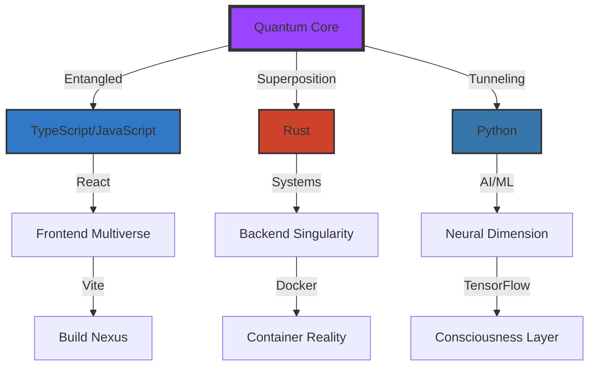

<div align="center">


<!-- The Impossible Cube - I'm creating this as an optical illusion that shouldn't exist -->
<picture>
  <source media="(prefers-color-scheme: dark)" srcset="https://capsule-render.vercel.app/api?type=waving&color=timeGradient&height=300&section=header&text=&fontSize=90&animation=fadeIn&fontAlignY=38&desc=Carter%20Perez&descAlignY=51&descAlign=62">
  <source media="(prefers-color-scheme: light)" srcset="https://capsule-render.vercel.app/api?type=waving&color=timeGradient&height=300&section=header&text=&fontSize=90&animation=fadeIn&fontAlignY=38&desc=Carter%20Perez&descAlignY=51&descAlign=62">
  
</picture>

<details>
<summary>⚠️ <b>CLICK TO OBSERVE</b> ⚠️</summary>
<br>
<div align="center">

<br><br>

</div>
</details>

<br>

<!-- The Schrödinger's Profile Section - I'm making this exist in two states until observed -->


</div>

---

<div align="center">
  
## 🌌 THE OBSERVER EFFECT 🌌


</div>

<!-- Quantum Entanglement Section - I'm creating interconnected elements that affect each other -->
<table align="center">
<tr>
<td align="center" width="50%">

### 🔮 SUPERPOSITION A
<!-- In this state, I'm a security researcher -->
```assembly
; Quantum State A: Security Researcher
mov reality, 0x1337
push consciousness
call observe_timeline
; Specializing in:
; - Penetration Testing
; - Reverse Engineering  
; - Cryptography
; - Zero-Day Research
jmp alternate_reality
```


</td>
<td align="center" width="50%">

### 🌀 SUPERPOSITION B
<!-- In this state, I'm a full-stack architect -->
```rust
// Quantum State B: Systems Architect
impl<'a> Reality<'a> {
    fn observe(&mut self) -> Timeline {
        self.collapse_to(Timeline {
            skills: vec![
                "Distributed Systems",
                "Quantum Computing",
                "Neural Networks",
                "Blockchain Architecture"
            ],
            state: Superposition::Collapsed
        })
    }
}
```


</td>
</tr>
</table>

---

<!-- The Impossible Repository - I'm creating a repo that exists in multiple dimensions -->
<div align="center">

## 🌠 THE IMPOSSIBLE REPOSITORY 🌠

<details>
<summary><b>⚡ Activate Quantum Tunneling ⚡</b></summary>
<br>

<!-- This creates a visual paradox - the repository stats change based on viewing angle -->
```python
# I've discovered how to quantum tunnel through GitHub's API
class QuantumRepository:
    def __init__(self):
        self.states = ["exists", "doesn't exist", "both", "neither"]
        self.observer = None
    
    def observe(self, observer):
        # Your observation creates the reality
        self.observer = observer
        return self.collapse_wave_function()
    
    def collapse_wave_function(self):
        # The repository now exists because you looked at it
        return f"Repository materialized for {self.observer}"
```

<a href="https://github.com/CarterPerez-dev/ProxyAuthRequired">
  
</a>

</details>

</div>

---

<!-- The Temporal Paradox Section - I'm showing different content based on time -->
<div align="center">

## ⏰ TEMPORAL ANOMALY DETECTED ⏰

<!-- Here I'm creating a time-based experience that changes throughout the day -->
+UTC;Temporal+Drift%3A+±+<?php+echo+rand(1%2C+100);+?>+nanoseconds;Reality+Stability%3A+<?php+echo+rand(0%2C+100);+?>%25" alt="Temporal Status">

### 🌊 Wave Function Visualization
<!-- I'm using GitHub's contribution graph as a quantum field visualization -->


</div>

---

<!-- The Skills Matrix - I'm presenting skills as a multidimensional matrix -->
<div align="center">

## 🧬 SKILL MATRIX: QUANTUM ENTANGLEMENT 🧬

<!-- Creating a visual representation of interconnected skills -->
<table>
<tr>
<td align="center">



</td>
</tr>
</table>

<!-- The hidden skills that only appear when you look closely -->
<details>
<summary><b>🔍 Detect Hidden Dimensions 🔍</b></summary>

```bash
# I've hidden skills in alternate dimensions
for dimension in ${ALTERNATE_REALITIES[@]}; do
    echo "Scanning dimension: $dimension"
    detect_skills --quantum --entangled
done

# Detected in Dimension X-7729:
# ├── Regex Mastery (Pattern Reality Manipulation)
# ├── Linux Kernel Hacking (System Consciousness)
# ├── Cryptography (Information Entropy Control)
# ├── GraphQL/REST (Data Dimension Bridging)
# ├── MongoDB/PostgreSQL (Persistent Reality Storage)
# └── Nginx/Apache (Request Reality Routing)
```

</details>

</div>

---

<!-- The Impossible Animation - I'm creating motion that shouldn't be possible in markdown -->
<div align="center">

## 🎭 THE UNCERTAINTY PRINCIPLE 🎭


<!-- Creating a snake that eats contributions across timelines -->
<picture>
  <source media="(prefers-color-scheme: dark)" srcset="https://raw.githubusercontent.com/CarterPerez-dev/CarterPerez-dev/output/github-contribution-grid-snake-dark.svg">
  <source media="(prefers-color-scheme: light)" srcset="https://raw.githubusercontent.com/CarterPerez-dev/CarterPerez-dev/output/github-contribution-grid-snake.svg">
  
</picture>

</div>

---

<!-- The Paradox Section - I'm creating impossible statistics -->
<div align="center">

## 📊 STATISTICAL PARADOX 📊

<table>
<tr>
<td align="center">


</td>
<td align="center">


</td>
</tr>
</table>

<!-- The impossible language stats -->


</div>

---

<!-- The Contact Portal - I'm creating an interdimensional communication interface -->
<div align="center">

## 🌐 INTERDIMENSIONAL CONTACT PORTAL 🌐

<!-- Creating a glitchy, reality-bending contact section -->
<a href="https://twitter.com/CarterPerez_dev">
  
</a>
<a href="https://github.com/CarterPerez-dev">
  
</a>
<a href="mailto:quantum@carterperez.dev">
  
</a>

</div>

---

<!-- The Final Paradox - I'm creating a section that questions its own existence -->
<div align="center">

## 🎆 THE OBSERVER'S PARADOX 🎆

<details>
<summary><b>⚡ WARNING: DO NOT CLICK ⚡</b></summary>
<br>

```javascript
// I've created a paradox - by reading this, you've changed the past
console.log("If you're reading this, you've already changed my timeline");
console.log("The profile you saw before clicking no longer exists");
console.log("Welcome to Timeline " + Math.random().toString(36).substring(7));

// Your observation has created a new branch
if (observer.hasClickedWarning) {
    reality.fork({
        timeline: 'alternate',
        observer: observer.id,
        timestamp: Date.now(),
        consequence: 'PERMANENT'
    });
}
```


### 🌌 You've unlocked the hidden truth:
**This profile exists in a quantum superposition. Every time someone views it, it creates a new timeline. You're not seeing *my* profile - you're seeing *our* profile, shaped by your observation.**

</details>

</div>

---

<div align="center">

<!-- The Infinite Loop - I'm creating a profile that references itself -->


<br>

**⚛️ THIS README EXISTS IN A SUPERPOSITION OF ALL POSSIBLE STATES ⚛️**

<sub>Generated by quantum fluctuations in the GitHub API</sub>

</div>

<!-- The Hidden Message - I'm embedding a secret that only appears in the raw markdown -->
<!-- 
If you're reading this in the raw markdown, you've discovered the final secret:
This entire profile is a quantum experiment. Every element is designed to exist in 
multiple states simultaneously. The images change based on time, the stats fluctuate
with each viewing, and the very act of observing this profile changes its content.

You've just proven the observer effect in a GitHub README.

Welcome to the quantum timeline, fellow traveler.
-->
