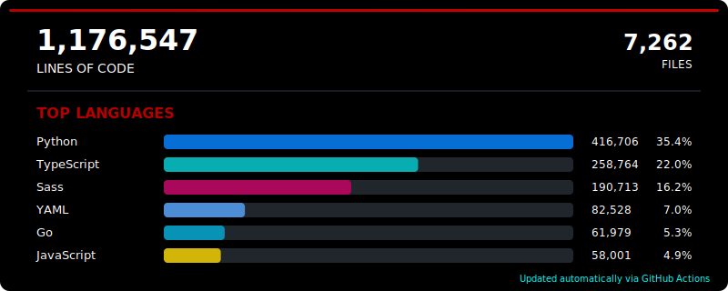
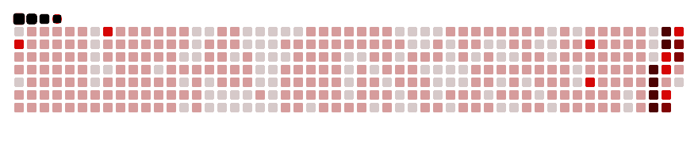

<!-- Profile Trophies -->
<div align="center">
    <a href="https://github.com/CarterPerez-dev/github-profile-trophy">
        
    </a>
</div>

<!-- LOC Stats SVG -->
<div align="center">
<!-- LOC-STATS:START -->

<!-- LOC-STATS:END -->
</div>

<!-- Github Stats -->
<p align="center">
     <strong>Github Stats</strong>
</p>

<p align="center">
<table align="center">
<tr>
<td width="50%" align="center">
    
</td>
<td width="50%" align="center">
    
</td>
</tr>
</table>
</p>

<br>

<a href="https://git.io/typing-svg">
    
</a>


  **Skills**


[](https://skillicons.dev)

### Development Environments:
 


<!-- Social Links -->
<div align="center">
  <a href="mailto:carterperez@certgames.com"></a>
  <a href="https://www.linkedin.com/in/carterperez-dev/"></a>
 <!-- <a href="https://aal1x-jobhub.github.io/jobhub-landing/"></a> -->
</div>


 ***About me***

I am expanding my knowledge in both back end and front end development. I solo developed [CertGames](https://github.com/CarterPerez-dev/CertGames-Core) which I'm always working to expand. As a side project, I'm working on building a Haskell reverse proxy.

- 🧙‍♂️ I’m currently learning ...
  - *Kubernetes*
  - *Rust*
- 👻 I’m ambitious with new things I do..
- 🫡 Feel free to ask me anything! I’m motivated to help others.
- 😎 Reach out to me at: <a href="carterPerez@certgames.com">Carterperez@certgames.com</a>
- 👽 [Portfolio](https://carterperez.dev)
<br>

<table>
<tr>
<td width="200px">

</td>
<td>

</td>
</tr>
</table>

```ruby
⠀⠀⠀⠀⠀⠴⣦⣤⡀⢄⠀⠀⠀⠀⠀⠀⠀⠀⠀⠀⠀⠀⣀⡀⠀⠀⠀⠀⠀⠀⠀⠀⠀⠀⠀⠀⠀⠀⠀⠀⠀⠀⠀⠀⠀⠀⠀⠀⠀⠀⠀⠀⠀⠀⠀⠀⠀⠀⠀
⠀⠀⠀⠀⠀⠀⠀⣨⣥⣄⣀⠀⡁⠀⠀⡀⡠⠀⠀⠀⠂⠁⠀⠀⠀⠀⠀⠀⠀⠀⠀⠀⠀⠀⠀⠀⠀⠀⠀⠀⠀⠀⠀⠀⠀⠀⠀⠀⠀⠀⠀⠀⠀⠀⠀⠀⠀⠀⠀
⠀⠀⠀⠀⠀⠀⢠⣾⣿⣷⣮⣷⡦⠥⠈⡶⠮⣤⣀⡠⠀⡀⣐⣀⡈⠁⠀⠐⠀⠀⠀⠀⠀⠀⠀⠀⠀⠀⠀⠀⠀⠀⠀⠀⠀⠀⠀⠀⠀⠀⠀⠀⠀⠀⠀⠀⠀⠀⠀
⠀⠀⠀⠀⠀⠀⣾⣿⣿⣿⣿⠟⠀⠠⠊⠉⠀⠀⢀⠉⠙⠚⠧⣦⣀⡀⢀⠀⠀⠀⠀⠀⠀⠀⠀⠀⠀⠀⠀⠀⠀⠀⠀⠀⠀⠀⠀⠀⠀⠀⠀⠀⠀⠀⠀⠀⠀⠀⠀
⠀⠀⠀⠀⠀⠀⣿⣿⣿⣿⡏⠀⠀⠀⠀⠀⠠⠀⠁⠀⢤⠀⠀⠀⠨⡉⠛⠶⠤⣄⣄⢀⠀⠀⠀⠀⠀⠀⠀⠀⠀⠀⠀⠀⠀⠀⠀⠀⠀⠀⠀⠀⠀⠀⠀⠀⠀⠀⠀
⠀⠀⠀⠀⠀⢀⣿⣿⣿⣿⡀⠀⠀⢰⠀⠍⡾⠆⠀⠀⣠⡦⠄⡀⠄⠀⠠⠀⠀⠀⠈⠙⠓⠦⢤⣀⡀⡀⠀⠀⠀⠀⠀⠀⠀⠀⠀⠀⠀⠀⠀⠀⠀⠀⠀⠀⠀⠀⠀
⠀⠀⠀⠀⠀⠸⣿⣿⣿⣿⣿⣶⣦⢠⡈⠀⠀⠀⠀⠀⠋⠛⠉⡂⠈⠙⠀⣰⠀⠀⠀⠀⠀⠀⠀⠀⠉⠛⠺⠦⣄⣀⠀⠀⠀⠀⠀⠀⠀⠀⠀⠀⠀⠀⠀⠀⠀⠀⠀
⠀⠀⠀⠀⠀⠀⠻⢿⣿⣿⣿⣿⣿⣾⣿⣿⣦⢤⡀⢀⣂⣨⠀⢅⢱⡔⠒⠀⠀⠀⠀⠀⠀⠀⠀⠀⠀⠀⠀⠀⠀⠉⠙⠲⠴⣠⠀⠀⠀⠀⠀⠀⠀⠀⠀⠀⠀⠀⠀
⠀⠀⠀⠀⠀⠀⠀⠀⠈⠙⠻⠿⣿⣿⣿⣿⣿⣿⣿⣿⣿⣶⣎⠘⠀⠀⠀⠀⠀⠀⠀⠀⠀⠀⠀⠀⠀⠀⠀⠀⠀⠀⠀⠀⠀⠈⠑⠠⠀⠀⠀⠀⠀⠀⠀⠀⠀⠀⠀
⠀⠀⠀⠀⠀⠀⠀⠀⢀⣤⣶⣾⣽⡿⢿⣿⣿⣿⣿⣿⣿⣿⣿⠳⢄⠀⠀⠀⠀⠀⠀⠀⠀⠀⠀⠀⠀⠀⠀⠀⠀⠀⠀⠀⠀⠀⠀⠀⠀⠀⠀⠀⠀⠀⠀⠀⠀⠀⠀
⠀⠀⠀⠀⠀⠀⠀⠀⣿⣿⠏⢠⣿⣿⣿⣿⣿⣿⣿⣿⣿⣿⣿⠁⠀⠹⣦⣴⠖⠲⠆⠀⠀⠀⠀⠀⠀⠀⠀⠀⠀⠀⠀⠀⠀⠀⠀⠀⠀⠀⠀⠀⠀⠀⠀⠀⠀⠀⠀
⠀⠀⠀⠀⠀⠀⠀⠀⠘⢿⠀⢻⣿⣿⣿⣿⣿⣿⣿⣿⣿⣿⠏⠀⠀⠈⠀⠀⠀⠒⠀⠀⠀⠀⠀⠀⠀⠀⠀⠀⠀⠀⠀⠀⠀⠀⠀⠀⠀⠀⠀⠀⠀⠀⠀⠀⠀⠀⠀
⠀⠀⠀⠀⠀⠀⠀⠀⠀⠀⢩⠢⣙⠿⣿⣿⣿⣿⣿⣿⡿⠃⠀⠀⠀⠀⠀⠀⠀⠀⠀⠀⠀⠀⠀⠀⠀⠀⠀⠀⠀⠀⠀⠀⠀⠀⠀⠀⠀⠀⠀⠀⠀⠀⠀⠀⠀⠀⠀
⠀⠀⠀⠀⠀⠀⠀⠀⠀⠀⠸⣆⠈⠛⢶⣌⡉⣻⣿⡿⠀⠀⠀⠀⠀⠀⠀⠀⠀⠀⠀⠀⠀⠀⠀⠀⠀⠀⠀⠀⠀⠀⠀⠀⠀⠀⠀⠀⠀⠀⠀⠀⠀⠀⠀⠀⠀⠀⠀
⠀⠀⠀⠀⠀⠀⠀⠀⠀⠀⠀⢻⣷⣄⣤⣙⣿⣿⣿⣷⣄⣀⣀⣀⣀⡀⠀⠀⠀⠀⠀⠀⠀⠀⠀⠀⠀⠀⠀⠀⠀⠀⠀⠀⠀⠀⠀⠀⠀⠀⠀⠀⠀⠀⠀⠀⠀⠀⠀
⠀⠀⠀⠀⠀⠀⠀⠀⠀⠀⠀⢠⣿⣿⣿⣿⣿⣿⣿⣿⣿⣿⣿⠿⠟⠛⠟⠠⠀⠀⠀⠀⠀⠀⠀⠀⠀⠀⠀⠀⠀⠀⠀⠀⠀⠀⠀⠀⠀⠀⠀⠀⠀⠀⠀⠀⠀⠀⠀
⠀⠀⠀⠀⠀⠀⠀⠀⠀⠀⣴⣿⡿⣿⣿⣿⣿⣿⣿⡿⠋⠉⠀⠀⠀⠀⠀⠀⡀⠀⠀⠀⠀⠀⠀⠀⠀⠀⠀⠀⠀⠀⠀⠀⠀⠀⠀⠀⠀⠀⠀⠀⠀⠀⠀⠀⠀⠀⠀
⠀⠀⠀⠀⠀⠀⠀⠀⠀⠁⠙⠁⠘⢮⣛⡽⠛⠿⡿⠥⠀⠀⠀⠀⠀⠀⠀⠀⠀⠀
```


